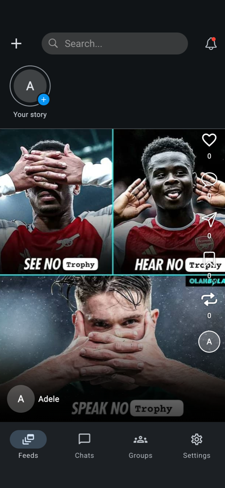
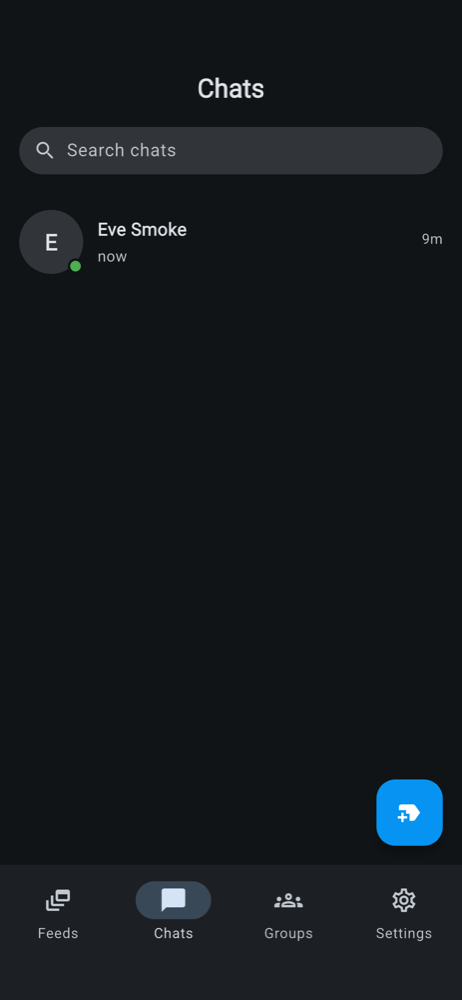
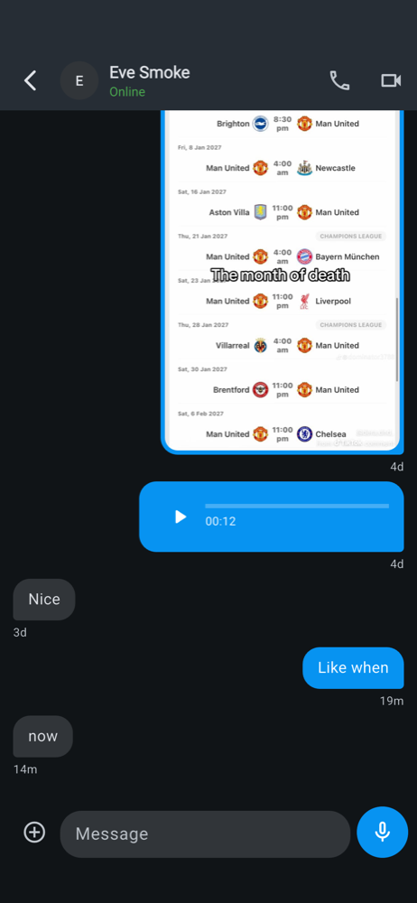
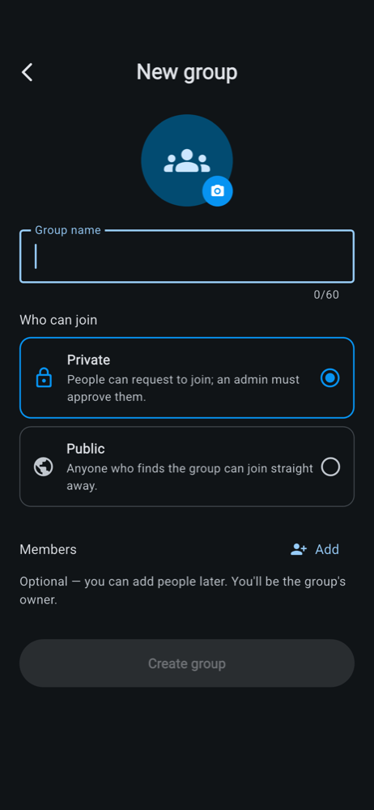

# Community Zone — Flutter social app

A full-featured social app built with Flutter: a reels-style feed with stories,
one-to-one and group chat with replies and reactions, and voice/video calling.
It talks to its own Node.js + TypeScript backend in [`../backend`](../backend).

<p>
  
  
  
  
</p>

## Features

**Feed and content**
- Reels-style vertical feed of image, video and text posts, with likes,
  comments (threaded, in a bottom sheet), reposts and bookmarks
- Stories: image, video or text on a background, with a viewer and progress bar
- Create posts with media, background sounds and tagged people
- User search, profiles with Posts / Reels / Reposts / Tagged tabs, follow/unfollow
- Shareable post links (`/share/posts/:id`) that open straight in the app via
  Android App Links / iOS Universal Links

**Messaging**
- One-to-one chats: text, photos, videos and voice notes, with upload progress,
  retry and cancel
- Group chats: public groups (join instantly) and private groups (request to
  join, admins approve), sender names, and system messages ("Eve joined the group")
- Group admin tools: edit name/photo/privacy, add/remove members, handle join requests
- Reply to a message (swipe right or long-press) with a quoted preview
- Emoji reactions with per-emoji counts, updated live for everyone
- Typing indicators ("Alice and Bob are typing…"), online status and unread counts
- Everything updates in real time over Socket.IO

**Calls**
- Voice and video calls over WebRTC, with a native incoming-call screen (CallKit)
  and ringing push notifications when the app is closed

**Account**
- Registration with phone and email verification (OTP), login, password reset
- Profile photo (with cropping), bio, light/dark theme
- Push notifications (Firebase Cloud Messaging) that open the right chat when tapped

## Tech stack

| Concern | Tool |
|---|---|
| Framework | Flutter (Dart 3.12+), Material 3 |
| State management | `flutter_bloc` (Bloc + `bloc_concurrency` transformers) |
| Navigation | `go_router` with a `StatefulShellRoute` for the bottom tabs |
| Networking | `dio` with an auth interceptor and single-flight token refresh |
| Real time | `socket_io_client` |
| Calls | `flutter_webrtc`, `flutter_callkit_incoming` |
| Push | `firebase_messaging`, `flutter_local_notifications` |
| Media | `image_picker`, `image_cropper`, `video_player`, `just_audio`, `record`, `cached_network_image` |
| Storage | `flutter_secure_storage` (tokens), `shared_preferences` |
| Dependency injection | `get_it` |

The backend is Express 5 + TypeScript, PostgreSQL via Prisma, Socket.IO,
Firebase Admin (push), Cloudinary (media) and Zod validation. Its API docs are
served with Swagger at `/api/docs`.

## Project structure

```
lib/
  core/          router, DI (get_it), networking, storage, theme, shared widgets
  models/        API models (fromJson/copyWith)
  repositories/  one class per API area (chat, group, post, user, …)
  services/      socket, push notifications, WebRTC, CallKit, uploads
  viewmodels/    Blocs — one folder per feature, events/states as part files
  views/         screens and their widgets, grouped by feature
```

## Getting started

### 1. Backend

```bash
cd ../backend
npm install
cp .env.example .env   # fill in DATABASE_URL, JWT_SECRET, Cloudinary keys
npx prisma migrate dev
npm run dev            # starts on PORT from .env
```

Push notifications also need a Firebase service-account key at the path set in
`FIREBASE_SERVICE_ACCOUNT_PATH`.

### 2. App

Create `mobile/.env` pointing at the backend's API:

```
API_BASE_URL=http://10.0.2.2:3000/api/
```

`10.0.2.2` is how the Android emulator reaches your computer's `localhost`.
The iOS simulator can use `http://localhost:3000/api/`. To test on a real
phone or across devices, expose the backend with a tunnel (e.g. ngrok) and use
that URL instead.

Then:

```bash
flutter pub get
flutter emulators --launch <emulator_id>   # e.g. Pixel_9_Pro
flutter run -d emulator-5554               # or pick a device from `flutter devices`
```

The app uses the Firebase project configured in `lib/firebase_options.dart`.
To use your own, re-run `flutterfire configure`.

> The iOS simulator can't receive push notifications (there's no APNs there),
> so test notifications and incoming calls on a real device or the Android emulator.
